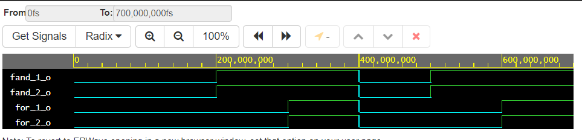
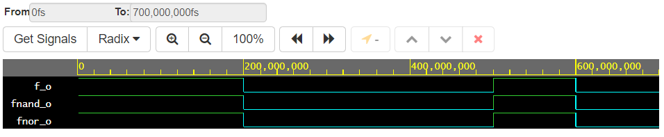

# Lab 01

## Distributive Laws
__VDHL Code__
```vhdl
entity gates is
    port(
        a_i      : in  std_logic;        
        b_i      : in  std_logic;        
        c_i      : in  std_logic;
        for_1_o  : out std_logic;      
        for_2_o  : out std_logic;
        fand_1_o : out std_logic;      
        fand_2_o : out std_logic
    );
end entity gates;


architecture dataflow of gates is
begin
    for_1_o  <= (b_i and a_i) or (b_i and c_i);
    for_2_o  <= b_i and ( a_i or c_i);
    fand_1_o <= (b_i or a_i) and (b_i or c_i);
    fand_2_o <= b_i or ( a_i and c_i);

end architecture dataflow;

```
__Screenshot of Simulation__



[Link to my EDA Playground](https://www.edaplayground.com/x/KUjh)


---
## De Morgan's Laws

__Table of Results__
| **c** | **b** |**a** | **f(c,b,a)** |
| :-: | :-: | :-: | :-: |
| 0 | 0 | 0 | 1 |
| 0 | 0 | 1 | 1 |
| 0 | 1 | 0 | 1 |
| 0 | 1 | 1 | 0 |
| 1 | 0 | 0 | 0 |
| 1 | 0 | 1 | 0 |
| 1 | 1 | 0 | 1 |
| 1 | 1 | 1 | 0 |

__VDHL Code__
```vhdl
entity gates is
    port(
        a_i     : in  std_logic;     
        b_i     : in  std_logic;     
        c_i     : in  std_logic;
        f_o     : out std_logic;      
        fnand_o : out std_logic;    
        fnor_o  : out std_logic      
    );
end entity gates;


architecture dataflow of gates is
begin
    f_o     <= (not b_i and a_i) or (not b_i and not c_i);
    fnand_o <= not (not (not b_i and a_i) and not (not b_i and not c_i));
    fnor_o  <= not (b_i or not a_i) or not (b_i or c_i);

end architecture dataflow;
```
__Screenshot of Simulation__



[Link to my EDA Playground](https://www.edaplayground.com/x/VZP6)
