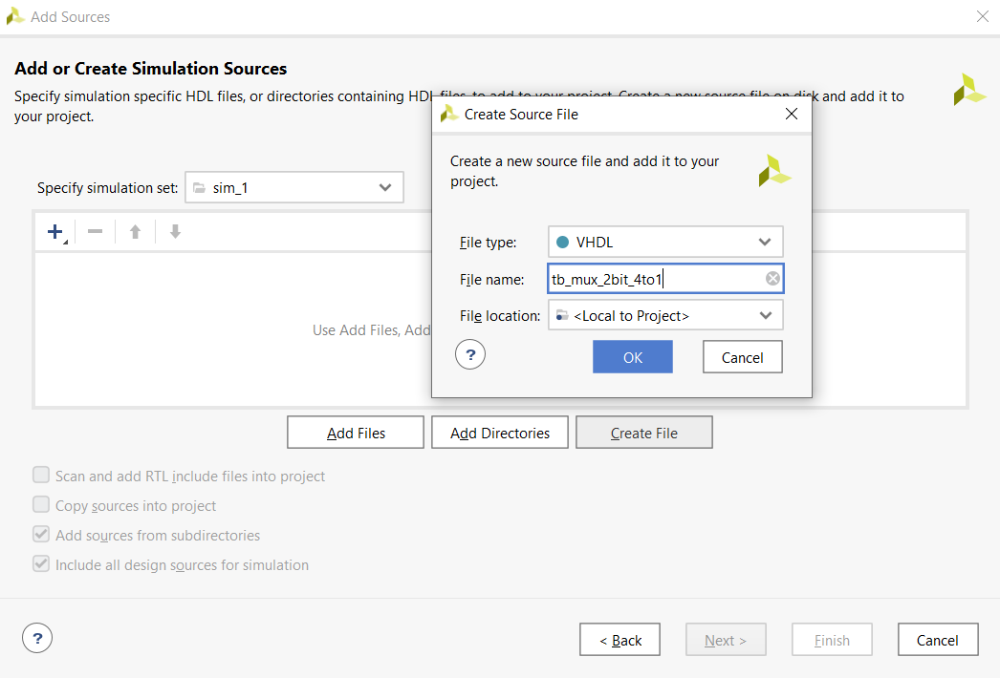

### [Github](https://github.com/valdzyu/Digital-electronics-1/tree/main/Labs/03-vivado)
# Lab 03

## Preparation tasks
__Switch Table__
| **switch** | **port** |
| :-: | :-: |		     
| SW0 | J15 |	     
| SW1 | L16 |	     
| SW2 | M13 |           			
| SW3 | R15 |	 
| SW4 | R17 |	     
| SW5 | T18 |            
| SW6 | U18 |            
| SW7 | R13 |
| SW8 | T8 | 
| SW9 | U8 | 
| SW10 | R16 |
| SW11 | T13 |
| SW12 | H6 |
| SW13 | U12 |
| SW14 | U11 |
| SW15 | V10 |
---
__LED Table__
| **LED** | **port** |
| :-: | :-: |
| LED0 | H17 |	
| LED1 | K15 |	
| LED2 | J13 |	 
| LED3 | N14 |	
| LED4 | R18 |	
| LED5 | V17 |	 
| LED6 | U17 |	 
| LED7 | U16 |
| LED8 | V16 |
| LED9 | T15 |
| LED10 | U14 |
| LED11 | T16 |
| LED12 | V15 |
| LED13 | V14 |
| LED14 | V12 |
| LED15 | V11 |

## Two-bit wide 4-to-1 multiplexer

__VHDL architecture__
```vhdl
architecture Behavioral of mux_2bit_4to1 is
begin
       f_o <= a_i when (sel_i = "00" ) else
              b_i when (sel_i = "01" ) else
              c_i when (sel_i = "10" ) else
              d_i when (sel_i = "11" );

end architecture Behavioral;
```

__VHDL stimulus process__
```vhdl
p_stimulus : process
begin

    report "Stimulus process started" severity note;

    s_a <= "00"; s_b <= "01"; s_c <= "10"; s_d <= "11";
    s_sel <= "00"; wait for 100 ns;
    
    s_a <= "01"; s_b <= "10"; s_c <= "11"; s_d <= "00";
    s_sel <= "10"; wait for 100 ns;
    
    s_a <= "10"; s_b <= "00"; s_c <= "01"; s_d <= "11";
    s_sel <= "01"; wait for 100 ns;
    
    s_a <= "01"; s_b <= "11"; s_c <= "10"; s_d <= "00";
    s_sel <= "11"; wait for 100 ns;
    
    s_a <= "10"; s_b <= "01"; s_c <= "00"; s_d <= "11";
    s_sel <= "00"; wait for 100 ns;
    
    s_a <= "11"; s_b <= "00"; s_c <= "10"; s_d <= "01";
    s_sel <= "10"; wait for 100 ns;
    
    s_a <= "01"; s_b <= "10"; s_c <= "11"; s_d <= "00";
    s_sel <= "01"; wait for 100 ns;
    
    s_a <= "10"; s_b <= "11"; s_c <= "00"; s_d <= "01";
    s_sel <= "11"; wait for 100 ns;

    report "Stimulus process finished" severity note;
    wait;
end process p_stimulus;
```

### Simulation


## Vivado tutorial

__Create project (File -> Project -> New)__


__Insert project name and choose location__


__Select project type__


__Add sources (select file type and input file name)__


__Select board (Boards -> Nexys A7-50T)__


__Click "Finish"__


__Add Sources (File -> Add Sources),__
__choose source type__


__Select file type and input file name__


__Simulation (Flow -> Run Simulation -> Run Behavioral Simulation)__
