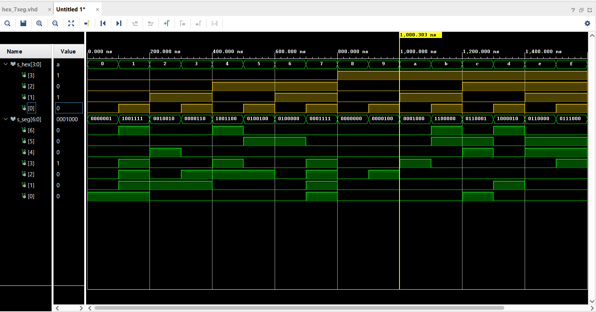
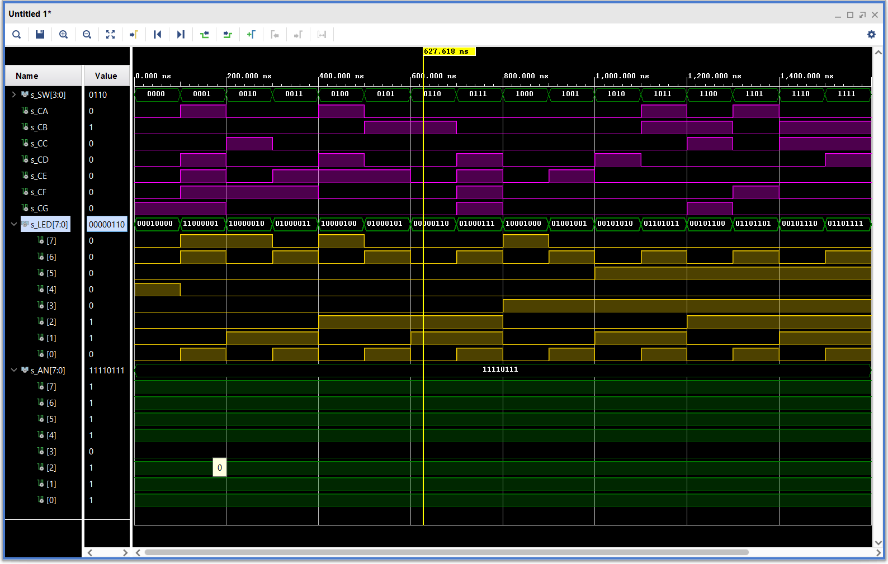

### [github](https://github.com/valdzyu/Digital-electronics-1/tree/main/Labs/04-segment)

# Lab 04

## Preparation Tasks


__Table with Connection of 7-segment Displays__

| **SW** | **SW PIN** | **AN** | **AN PIN** | **7seg LED** | **7seg PIN** |
| :-: | :-: | :-: | :-: | :-: | :-: |
| SW0 | J15 | AN7 | U13 | CA | T10 |
| SW1 | L16 | AN6 | K2 | CB | R10 |
| SW2 | M13 | AN5 | T14 | CC | K16 |
| SW3 | R15 | AN4 | P14 | CD | K13 |
| SW4 | R17 | AN3 | J14 | CE | P15 |
| SW5 | T18 | AN2 | T9 | CF | T11 |
| SW6 | U18 | AN1 | J18 | CG | L18 |
| SW7 | R13 | AN0 | J17 | DP | H15 |

__Decoder Truth Table for Common Anode 7-segment Display__
| **Hex** | **Inputs** | **A** | **B** | **C** | **D** | **E** | **F** | **G** |
| :-: | :-: | :-: | :-: | :-: | :-: | :-: | :-: | :-: |
| 0 | 0000 | 0 | 0 | 0 | 0 | 0 | 0 | 1 |
| 1 | 0001 | 1 | 0 | 0 | 1 | 1 | 1 | 1 |
| 2 | 0010 | 0 | 0 | 1 | 0 | 0 | 1 | 0 |
| 3 | 0011 | 0 | 0 | 0 | 0 | 1 | 1 | 0 |
| 4 | 0100 | 1 | 0 | 0 | 1 | 1 | 0 | 0 |
| 5 | 0101 | 0 | 1 | 0 | 0 | 1 | 0 | 0 |
| 6 | 0110 | 0 | 1 | 0 | 0 | 0 | 0 | 0 |
| 7 | 0111 | 0 | 0 | 0 | 1 | 1 | 1 | 1 |
| 8 | 1000 | 0 | 0 | 0 | 0 | 0 | 0 | 0 |
| 9 | 1001 | 0 | 0 | 0 | 0 | 1 | 0 | 0 |
| A | 1010 | 0 | 0 | 0 | 1 | 0 | 0 | 0 |
| b | 1011 | 1 | 1 | 0 | 0 | 0 | 0 | 0 |
| C | 1100 | 0 | 1 | 1 | 0 | 0 | 0 | 1 |
| d | 1101 | 1 | 0 | 0 | 0 | 0 | 1 | 0 |
| E | 1110 | 0 | 1 | 1 | 0 | 0 | 0 | 0 |
| F | 1111 | 0 | 1 | 1 | 1 | 0 | 0 | 0 |


## Seven-segment Display Decoder

__VHDL Architecture__
```VHDL
architecture Behavioral of hex_7seg is
begin
    p_7seg_decoder : process(hex_i)
    begin
        case hex_i is
            when "0000" => seg_o <= "0000001";  -- 0
            when "0001" => seg_o <= "1001111";  -- 1
            when "0010" => seg_o <= "0010010";  -- 2
            when "0011" => seg_o <= "0000110";  -- 3
            when "0100" => seg_o <= "1001100";  -- 4
            when "0101" => seg_o <= "0100100";  -- 5
            when "0110" => seg_o <= "0100000";  -- 6
            when "0111" => seg_o <= "0001111";  -- 7
            when "1000" => seg_o <= "0000000";  -- 8
            when "1001" => seg_o <= "0000100";  -- 9
            when "1010" => seg_o <= "0001000";  -- A
            when "1011" => seg_o <= "1100000";  -- b
            when "1100" => seg_o <= "0110001";  -- C
            when "1101" => seg_o <= "1000010";  -- d
            when "1110" => seg_o <= "0110000";  -- E
            when others => seg_o <= "0111000";  -- F
        end case;
    end process p_7seg_decoder;
```

__VHDL Stimulus Process__
```VHDL
p_7seg_decoder : process
    begin
        report "Stimulus process started" severity note;
        s_hex <= "0000"; 
        wait for 100 ns;
        
        s_hex <= "0001"; 
        wait for 100 ns;
        
        s_hex <= "0010"; 
        wait for 100 ns;
        
        s_hex <= "0011"; 
        wait for 100 ns;
        
        s_hex <= "0100"; 
        wait for 100 ns;
        
        s_hex <= "0101"; 
        wait for 100 ns;
        
        s_hex <= "0110"; 
        wait for 100 ns;
        
        s_hex <= "0111"; 
        wait for 100 ns;
        
        s_hex <= "1000"; 
        wait for 100 ns;
        
        s_hex <= "1001"; 
        wait for 100 ns;
        
        s_hex <= "1010"; 
        wait for 100 ns;
        
        s_hex <= "1011"; 
        wait for 100 ns;
        
        s_hex <= "1100"; 
        wait for 100 ns;
        
        s_hex <= "1101"; 
        wait for 100 ns;
        
        s_hex <= "1110"; 
        wait for 100 ns;
        
        s_hex <= "1111";

        report "Stimulus process finished" severity note; 
        wait;
    end process p_7seg_decoder;
```

__Screenshot with Simulated Time Waveforms__



__VHDL Code with 7-segment Module Instantiation__
```VHDL
hex2seg : entity work.hex_7seg
    port map(
        hex_i    => SW, 
        seg_o(6) => CA,
        seg_o(5) => CB 
        seg_o(4) => CC 
        seg_o(3) => CD 
        seg_o(2) => CE 
        seg_o(1) => CF 
        seg_o(0) => CG
    );
```

## LED(7:4) Indicators

__Truth Table for LEDs(7:4)__
| **Hex** | **Inputs** | **LED4** | **LED5** | **LED6** | **LED7** |
| :-: | :-: | :-: | :-: | :-: | :-: |
| 0 | 0000 | 1 | 0 | 0 | 0 |
| 1 | 0001 | 0 | 0 | 1 | 1 |
| 2 | 0010 | 0 | 0 | 0 | 1 |
| 3 | 0011 | 0 | 0 | 1 | 0 |
| 4 | 0100 | 0 | 0 | 0 | 1 |
| 5 | 0101 | 0 | 0 | 1 | 0 |
| 6 | 0110 | 0 | 0 | 0 | 0 |
| 7 | 0111 | 0 | 0 | 1 | 0 |
| 8 | 1000 | 0 | 0 | 0 | 1 |
| 9 | 1001 | 0 | 0 | 1 | 0 |
| A | 1010 | 0 | 1 | 0 | 0 |
| b | 1011 | 0 | 1 | 1 | 0 |
| C | 1100 | 0 | 1 | 0 | 0 |
| d | 1101 | 0 | 1 | 1 | 0 |
| E | 1110 | 0 | 1 | 0 | 0 |
| F | 1111 | 0 | 1 | 1 | 0 |

__VHDL Code for LEDs(7:4)__
```VHDL
LED(3 downto 0) <= SW;

LED (4) <=  '1' when (SW = "0000") 
                else '0';

LED (5) <=  '1' when (SW > "1001") 
                else '0';

LED (6) <=  '1' when (SW(0) = '1') 
                else '0';

LED (7) <=  '1' when (SW = "0001" or 
                      SW = "0010" or 
                      SW = "0100" or 
                      SW = "1000") else '0';   
```
__Screenshot with Simulated Time Waveforms__

