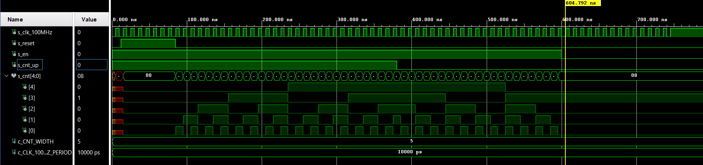

### [github](https://github.com/valdzyu/Digital-electronics-1/tree/main/Labs/05-counter)

# Lab 05

## Preparation Tasks

__Table with Connection of Push Buttons on Nexys A7 Board__

| **Button** | **Voltage value (on) [V]** | **Voltage value (off) [V]** | **Pin** |
   | :-: | :-: | :-: | :-: |
   | BTNL | 3,3 | 0 | P17 |
   | BTNR | 3,3 | 0 | M17 |
   | BTNU | 3,3 | 0 | M18 |
   | BTND | 3,3 | 0 | P18 |
   | BTNC | 3,3 | 0 | N17 |
   | BTNRES | 3,3 | 0 | C12 |

__Table with Calculated Values__

| **Time interval** | **Number of clk periods** | **Number of clk periods in hex** | **Number of clk periods in binary** |
| :-: | :-: | :-: | :-: |
| 2 ms | 200 000 | x"3_0d40" | b"0011_0000_1101_0100_0000" |
| 4 ms |400 000| x"6_1a80" | b"0110_0001_1010_1000_0000" |
| 10 ms |1 000 000| x"F_4240" | b"1111_0100_0010_0100_0000" |
| 250 ms |25 000 000| x"17d_7840" | b"0001_0111_1101_0111_1000_0100_0000" |
| 500 ms |50 000 000| x"2fa_f080" | b"0010_1111_1010_1111_0000_1000_0000" |
| 1 sec | 100 000 000 | x"5F5_E100" | b"0101_1111_0101_1110_0001_0000_0000" |


## Bidirectional counter

__VHDL Code of the Process p_cnt_up_down__
```VHDL
p_cnt_up_down : process(clk)
    begin
        if rising_edge(clk) then
        
            if (reset = '1') then
                s_cnt_local <= (others => '0');

            elsif (en_i = '1') then  
                if (cnt_up_i = '1') then
                    s_cnt_local <= s_cnt_local + 1;             
                else         
                    s_cnt_local <= s_cnt_local - 1;    
                            
                end if;
            end if;
        end if;
    end process p_cnt_up_down;
```

__VHDL Reset and Stimulus Processes__
```VHDL
p_reset_gen : process
    begin
        s_reset <= '0';
        wait for 12 ns;
        
        s_reset <= '1';
        wait for 73 ns;

        s_reset <= '0';
        wait;
    end process p_reset_gen;

p_stimulus : process
    begin
        report "Stimulus process started" severity note;

        s_en     <= '1';
        
        s_cnt_up <= '1';
        wait for 380 ns;
        s_cnt_up <= '0';
        wait for 220 ns;

        s_en     <= '0';

        report "Stimulus process finished" severity note;
        wait;
    end process p_stimulus;
```

__Screenshot with Simulated Time waveforms__



## Top level

__VHDL Code with All Instantiations for the 4-bit Bidirectional Counter__
```VHDL
clk_en0 : entity work.clock_enable
    generic map(
        g_MAX => 100000000
    )
    port map(
        clk   => CLK100MHZ,
        reset => BTNC,
        ce_o  => s_en
    );

bin_cnt0 : entity work.cnt_up_down
    generic map(
        g_CNT_WIDTH => 4
    )
    port map(
        clk      => CLK100MHZ,
        reset    => BTNC,
        en_i     => s_en,
        cnt_up_i => SW(0),
        cnt_o    => s_cnt
    );

LED(3 downto 0) <= s_cnt;

hex2seg : entity work.hex_7seg
    port map(
        hex_i    => s_cnt,
        seg_o(6) => CA,
        seg_o(5) => CB,
        seg_o(4) => CC,
        seg_o(3) => CD,
        seg_o(2) => CE,
        seg_o(1) => CF,
        seg_o(0) => CG
    );

AN <= b"1111_1110";
```
__Images of the top layer including both counters__
