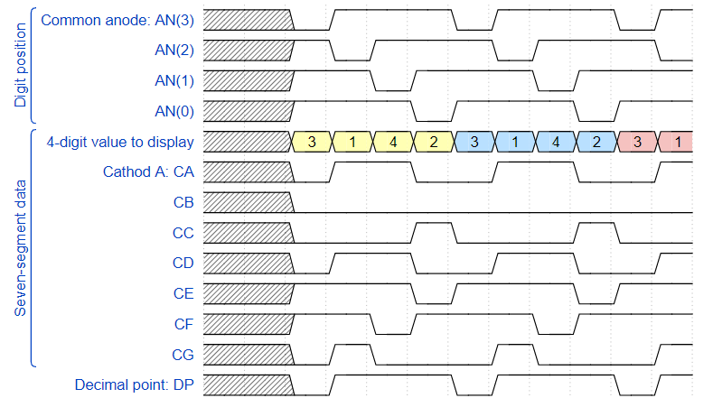
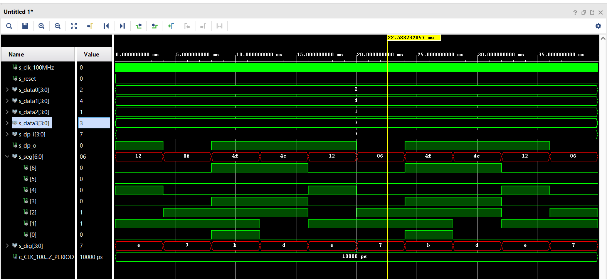
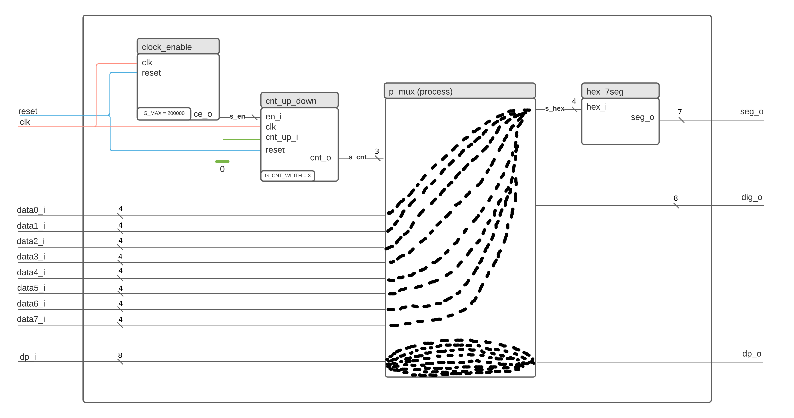

### [github](https://github.com/valdzyu/Digital-electronics-1/tree/main/Labs/06-display_driver)

# Lab 06

## Preparation Tasks

__Timing diagram figure for displaying value 3.142__



## Display driver

__VHDL code of the process p_mux__
```VHDL
p_mux : process(s_cnt, data0_i, data1_i, data2_i, data3_i, dp_i)
    begin
        case s_cnt is
            when "11" =>
                s_hex <= data0_i;
                dp_o  <= dp_i(3);
                dig_o <= "0111";
            when "10" =>
                s_hex <= data1_i;
                dp_o  <= dp_i(2);
                dig_o <= "1011";
            when "01" =>
                s_hex <= data2_i;
                dp_o  <= dp_i(1);
                dig_o <= "1101";
            when others =>
                s_hex <= data3_i;
                dp_o  <= dp_i(0);
                dig_o <= "1110";        
        end case;
    end process p_mux;
```

__VHDL testbench file tb_driver_7seg_4digits__
```VHDL
library ieee;
use ieee.std_logic_1164.all;

------------------------------------------------------------------------
-- Entity declaration for testbench
------------------------------------------------------------------------
entity tb_driver_7seg_4digits is
    -- Entity of testbench is always empty
end entity tb_driver_7seg_4digits;

------------------------------------------------------------------------
-- Architecture body for testbench
------------------------------------------------------------------------
architecture testbench of tb_driver_7seg_4digits is

    -- Local constants
    constant c_CLK_100MHZ_PERIOD : time    := 10 ns;

    --Local signals
    signal s_clk_100MHz : std_logic;
    signal s_clk        : std_logic;
    signal s_reset      : std_logic;

    -- Inputs
    signal s_data0_i    : std_logic_vector(4 - 1 downto 0);
    signal s_data1_i    : std_logic_vector(4 - 1 downto 0);
    signal s_data2_i    : std_logic_vector(4 - 1 downto 0);
    signal s_data3_i    : std_logic_vector(4 - 1 downto 0);
    signal s_dp_i       : std_logic_vector(4 - 1 downto 0);

    -- Outputs
    signal s_dp_o       : std_logic;
    signal s_seg_o      : std_logic_vector(7 - 1 downto 0);
    signal s_dig_o      : std_logic_vector(4 - 1 downto 0);
    
    begin
    uut_driver_7seg_4digits : entity work.driver_7seg_4digits
        port map ( 
            clk     => s_clk_100MHz,
            reset   => s_reset,

            data0_i => s_data0_i,
            data1_i => s_data1_i,
            data2_i => s_data2_i,
            data3_i => s_data3_i,
            dp_i    => s_dp_i,

            dp_o    => s_dp_o,
            seg_o   => s_seg_o,
            dig_o   => s_dig_o
        ); 

    p_clk_gen : process
    begin
        while now < 750 ns loop         -- 75 periods of 100MHz clock
            s_clk_100MHz <= '0';
            wait for c_CLK_100MHZ_PERIOD / 2;
            s_clk_100MHz <= '1';
            wait for c_CLK_100MHZ_PERIOD / 2;
        end loop;
        wait;
    end process p_clk_gen;

    --------------------------------------------------------------------
    -- Reset generation process
    --------------------------------------------------------------------
    p_reset : process 
    begin      
        s_reset <= '0';
        wait for 28 ns;

        s_reset <= '1'; -- activated
        wait for 53 ns;

        s_reset <= '0'; -- deactivated
        wait;
    end process p_reset;
    
    --------------------------------------------------------------------
    -- Data generation process
    --------------------------------------------------------------------
    p_stimulus : process
    begin
        report "Stimulus process started" severity note;
        s_data3 <= "0011";
        s_data2 <= "0001";
        s_data1 <= "0100";
        s_data0 <= "0010";
               
        s_dp_i  <= "0111";
        wait for 6 ms;
        
        assert ((s_seg = "0000110") and (s_dig = "0111") and (s_dp_o = '0')) -- 3.
        report "Test failed for input: '3.' " severity error;
        wait for 4 ms;
        
        assert ((s_seg = "1001111") and (s_dig = "1011") and (s_dp_o = '1')) -- 1
        report "Test failed for input: '1' " severity error;
        wait for 4 ms;
        
        assert ((s_seg = "1001100") and (s_dig = "1101") and (s_dp_o = '1')) -- 4
        report "Test failed for input: '4' " severity error;
        wait for 4 ms;
        
        assert ((s_seg = "0010010") and (s_dig = "1110") and (s_dp_o = '1')) -- 2
        report "Test failed for input: '2' " severity error;

        report "Stimulus process finished" severity note;
        wait;
    end process p_stimulus;

end architecture testbench;
```

__Simulated Time Waveforms__



__VHDL architecture of the top layer__
```VHDL
architecture Behavioral of top is
    -- No internal signals
begin
    driver_seg_4 : entity work.driver_7seg_4digits
        port map(
            clk        => CLK100MHZ,
            reset      => BTNC,
            
            data0_i(3) => SW(3),  -- 0-15
            data0_i(2) => SW(2),
            data0_i(1) => SW(1),
            data0_i(0) => SW(0),

            data1_i(3) => SW(7),
            data1_i(2) => SW(6),
            data1_i(1) => SW(5),
            data1_i(0) => SW(4),
            
            data2_i(3) => SW(11),
            data2_i(2) => SW(10),
            data2_i(1) => SW(9),
            data2_i(0) => SW(8),
            
            data3_i(3) => SW(15),
            data3_i(2) => SW(14),
            data3_i(1) => SW(13),
            data3_i(0) => SW(12),
            
            seg_o(6)   => CA, -- CA-CG
            seg_o(5)   => CB,
            seg_o(4)   => CC,
            seg_o(3)   => CD,
            seg_o(2)   => CE,
            seg_o(1)   => CF,
            seg_o(0)   => CG,

            dp_o => DP,
            dig_o => AN(4 - 1 downto 0)
        );
    AN(7 downto 4) <= b"1111";
end architecture Behavioral;
```

## Eight-digit driver
__Image of the driver schematic__

