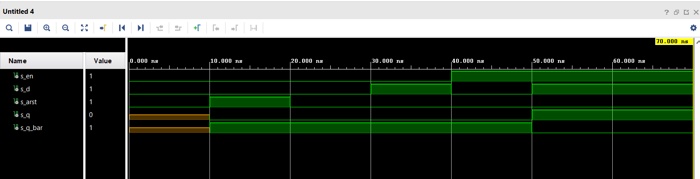
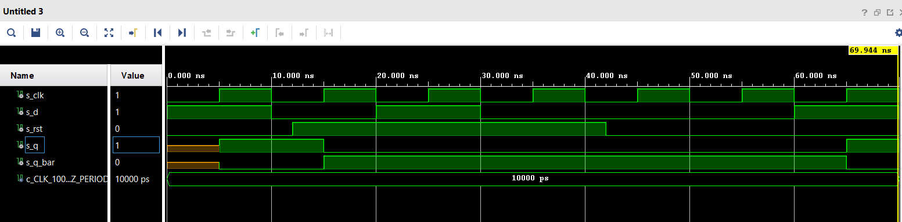
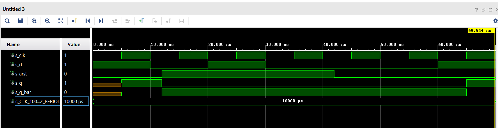
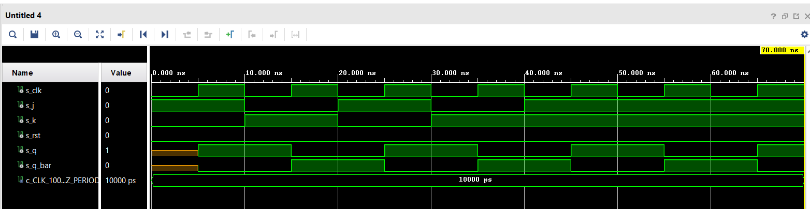
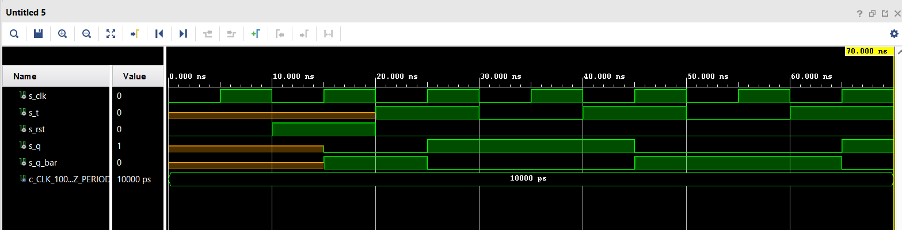
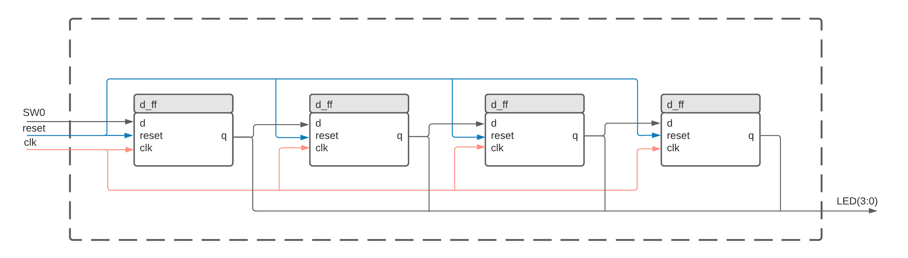

### [github](https://github.com/valdzyu/Digital-electronics-1/tree/main/Labs/07-ffs)

# Lab 07

## Preparation Tasks

__Characteristic equations__


__D flip-flop__

| **clk** | **d** | **q(n)** | **q(n+1)** | **Comments** |
| :-: | :-: | :-: | :-: | :-- |
|  | 0 | 0 | 0 |  |
|  | 0 | 1 | 0 |  |
|  | 1 | 0 | 1 |  |
|  | 1 | 1 | 1 |  |

__JK flip-flop__

| **clk** | **j** | **k** | **q(n)** | **q(n+1)** | **Comments** |
| :-: | :-: | :-: | :-: | :-: | :-- |
|  | 0 | 0 | 0 | 0 | No change |
|  | 0 | 0 | 1 | 1 | No change |
|  | 0 | 1 | 0 | 0 | Reset |
|  | 0 | 1 | 1 | 0 | Reset |
|  | 1 | 0 | 0 | 1 | Set |
|  | 1 | 0 | 1 | 1 | Set |
|  | 1 | 1 | 0 | 1 | Toggle |
|  | 1 | 1 | 1 | 0 | Toggle |

__T flip-flop__

| **clk** | **t** | **q(n)** | **q(n+1)** | **Comments** |
| :-: | :-: | :-: | :-: | :-- |
|  | 0 | 0 | 0 | No change |
|  | 0 | 1 | 1 | No change |
|  | 1 | 0 | 1 | Toggle |
|  | 1 | 1 | 0 | Toggle |


## D latch

__VHDL code of the process p_d_latch__
```VHDL
p_d_latch : process(d, arst, en)
begin
	if (arst = '1') then
		q <= '0';
		q_bar <= '1';
	elsif (en = '1') then
		q <= d;
		q_bar <= not d;
	end if;
end process p_d_latch;
```

__VHDL reset and stimulus processes from the testbench tb_d_latch.vhd__
```VHDL
p_reset_gen : process
begin
	s_arst <= '0';
	wait for 38 ns;

	s_arst <= '1'; -- activated
	wait for 53 ns;

	s_arst <= '0'; -- deactivated
	wait for 80 ns;

	s_arst <= '1';

	wait;
end process p_reset_gen;

p_stimulus : process
    begin
        report "Stimulus process started" severity note;
        
        s_en    <=  '0';
        s_arst  <=  '0';

        s_d     <=  '0'; 
        wait for 10 ns;
        s_arst  <=  '1';
        wait for 10 ns;

        s_arst  <=  '0';

        -- en = 0, d = 0, arst = 0
        s_en    <=  '0';
        s_d     <=  '0';
        wait for 10ns;
        s_arst  <=  '0';
        assert (s_q = '0' and s_q_bar = '1') report "Chyba en = 0, d = 0, arst = 0" severity error;

        -- en = 0, d = 1, arst = 0
        s_en    <=  '0';
        s_d     <=  '1';
        wait for 10ns;
        s_arst  <=  '0';
        assert (s_q = '0' and s_q_bar = '1') report "Chyba en = 0, d = 1, arst = 0" severity error;

        -- en = 1, d = 0, arst = 0       
        s_en    <=  '1';
        s_d     <=  '0';
        wait for 10ns;
        s_arst  <=  '0';
        assert (s_q = '0' and s_q_bar = '1') report "Chyba en = 1, d = 0, arst = 0" severity error;

        -- en = 1, d = 1, arst = 0       
        s_en    <=  '1';
        s_d     <=  '1';
        wait for 10ns;
        s_arst  <=  '0';
        assert (s_q = '1' and s_q_bar = '0') report "Chyba en = 1, d = 1, arst = 0" severity error;

        -- en = 1, d = 1, arst = 1
        s_en    <=  '1';
        s_d     <=  '1';
        wait for 10ns;
        s_arst  <=  '1';
        assert (s_q = '0' and s_q_bar = '1') report "Chyba en = 1, d = 1, arst = 1" severity error;

        report "Stimulus process end" severity note;
        wait;
    end process p_stimulus;

```

__Simulated Time Waveforms__



## Flip-flops

__VHDL Code of the process p_d_ff_arst__
```VHDL
p_d_ff_arst : process(clk)
begin        
    if rising_edge(clk) then
        if (rst = '1') then
            q       <= '0';
            q_bar   <= '1';
        else
            q       <= d;
            q_bar   <= not d;
        end if;
    end if;
end process p_d_ff_arst;
```


__VHDL code of the process p_d_ff_rst__
```VHDL
p_d_ff_rst : process(clk)
begin        
    if rising_edge(clk) then
        if (rst = '1') then
            q       <= '0';
            q_bar   <= '1';
        else
            q       <= d;
            q_bar   <= not d;
        end if;
    end if;
end process p_d_ff_rst;
```

__VHDL code of the process p_jk_ff_rst__
```VHDL
jk_ff_rst : process(clk)
begin
    if rising_edge(clk) then
        if (rst = '1') then
            s_q     <=  '0';
            s_q_bar <=  '1'; 
        else
            if (j = '0' and k = '0') then
                s_q     <=  s_q;
                s_q_bar <=  s_q_bar;
            if (j = '0' and k = '1') then
                s_q     <=  '0';
                s_q_bar <=  '1';
            if (j = '1' and k = '0') then
                s_q     <=  '1';
                s_q_bar <=  '0';
            if (j = '1' and k = '1') then
                s_q     <=  not s_q;
                s_q_bar <=  not s_q_bar;
            end if;
        end if;
    end if;
end process jk_ff_rst;
```

__VHDL code of the process p_t_ff_rst__
```VHDL
t_ff_rst : process(clk)
begin
    if rising_edge(clk) then
        if (rst = '1') then
            s_q     <=  '0';
            s_q_bar <=  '1'; 
        else
            if (t = '0') then
                s_q     <=  s_q;
                s_q_bar <=  s_q_bar;
            if (t = '1') then
                s_q     <=  not s_q;
                s_q_bar <=  not s_q_bar;
            end if;
        end if;
    end if;
end process t_ff_rst;
```

__VHDL Code of clock, reset and stimulus processes__
```VHDL
p_clk_gen : process
begin
    while now < 750 ns loop
        s_clk <= '0';
        wait for c_CLK_100MHZ_PERIOD / 2;
        s_clk <= '1';
        wait for c_CLK_100MHZ_PERIOD / 2;
    end loop;
    wait;
end process p_clk_gen;

p_reset_gen : process
begin
    s_arst <= '0';
    wait for 12 ns;
    s_arst <= '1';
    wait for 30 ns;
    s_arst <= '0';
    wait;
end process p_reset_gen;

p_stimulus : process
begin
    report "Stimulus process started" severity note;
    s_d  <=  '1';
    wait for 10ns;
    assert (s_q = '0' and s_q_bar = '1') report "d = 1" severity error;
    
    s_d  <=  '0';
    wait for 10ns;
    assert (s_q = '0' and s_q_bar = '1') report "d = 0" severity error;
    
    s_d  <=  '1';
    wait for 10ns;
    assert (s_q = '1' and s_q_bar = '0') report "d = 1" severity error;
    
    s_d  <=  '0';
    wait for 10ns;
    assert (s_q = '0' and s_q_bar = '1') report "d = 0" severity error;
    
    wait for 20ns;

    s_d   <=  '1';
    wait for 10ns;
    assert (s_q = '0' and s_q_bar = '1') report "d = 1" severity error;
    
    report "Stimulus process ended" severity note;
    wait;
end process p_stimulus;
```

__Simulated time waveforms__

d_rst


d_arst


jk_rst


t_rst


## Shift register
__Image of the shift register schematic__

