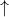
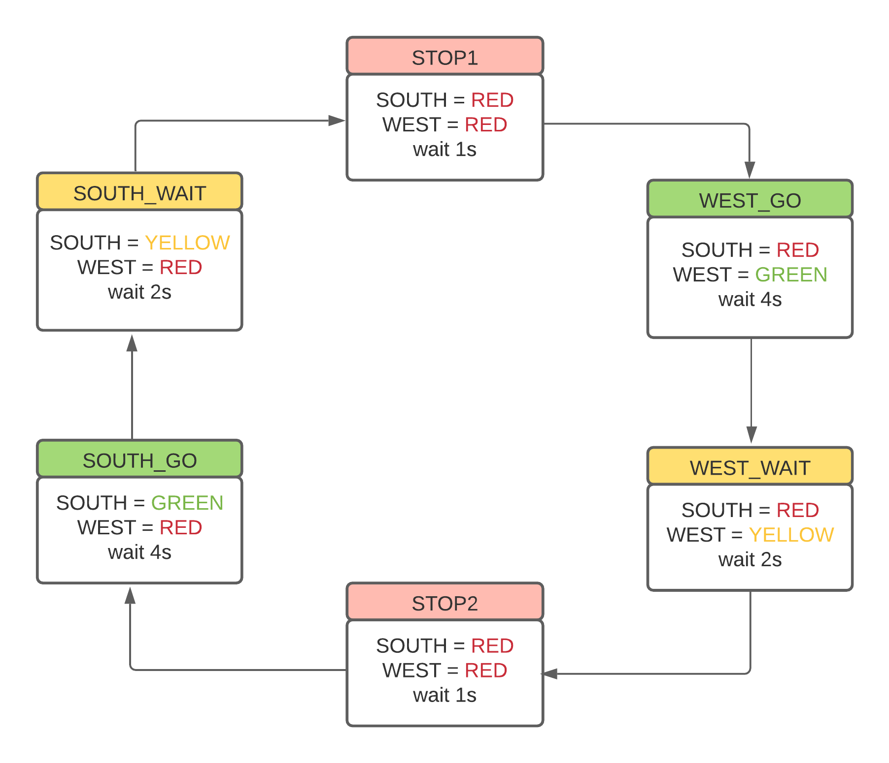
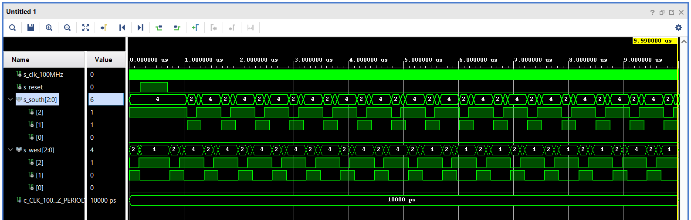
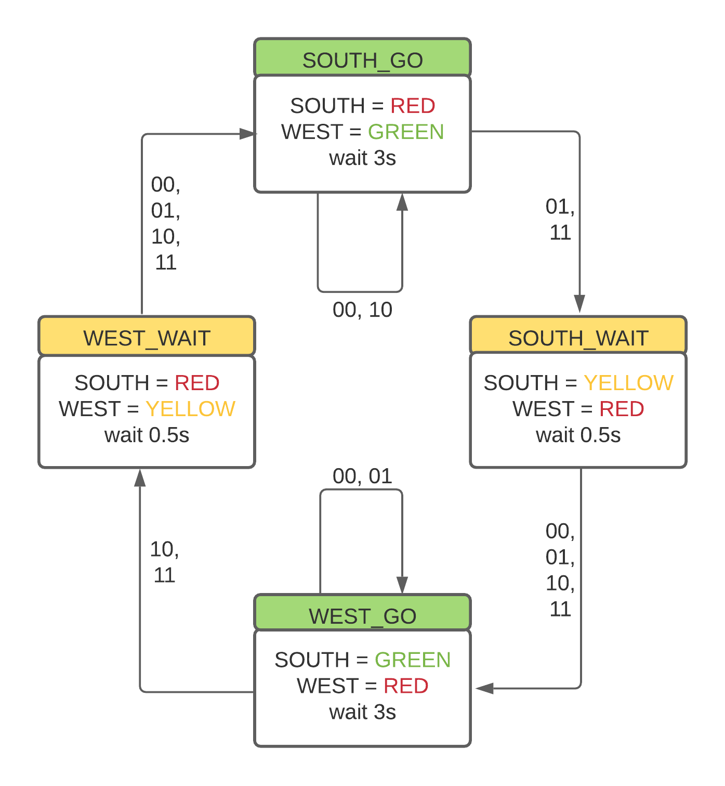

### [github](https://github.com/valdzyu/Digital-electronics-1/tree/main/Labs/08-traffic_ligths)

# Lab 08

## Preparation Tasks

__Completed state table__
| **Input P** | 0 | 0 | 1 | 1 | 0 | 1 | 0 | 1 | 1 | 1 | 1 | 0 | 0 | 1 | 1 | 1 |
| :-- | :-: | :-: | :-: | :-: | :-: | :-: | :-: | :-: | :-: | :-: | :-: | :-: | :-: | :-: | :-: | :-: |
| **Clock** |  |  |  |  |  |  |  |  |  |  |  |  |  |  |  |  |
| **State** | A | A | B | C | C | D | A | B | C | D | B | B | B | C | D | B |
| **Output R** | 0 | 0 | 0 | 0 | 0 | 1 | 0 | 0 | 0 | 1 | 0 | 0 | 0 | 0 | 1 | 0 |

__Connection of RGB LEDs on Nexys A7 board__
| **RGB LED** | **Artix-7 pin names** | **Red** | **Yellow** | **Green** |
| :-: | :-: | :-: | :-: | :-: |
| LD16 | N15, M16, R12 | 1, 0, 0 | 1, 1, 0 | 0, 1, 0 |
| LD17 | N16, R11, G14 | 1, 0, 0 | 1, 1, 0 | 0, 1, 0 |

## Traffic light controller

__State diagram__



__VHDL code of sequential process p_traffic_fsm__
```VHDL
p_traffic_fsm : process(clk)
begin
    if rising_edge(clk) then
        if (reset = '1') then       -- Synchronous reset
            s_state <= STOP1 ;      -- Set initial state
            s_cnt   <= c_ZERO;      -- Clear all bits

        elsif (s_en = '1') then
            -- Every 250 ms, CASE checks the value of the s_state 
            -- variable and changes to the next state according 
            -- to the delay value.
            case s_state is

                -- If the current state is STOP1, then wait 1 sec
                -- and move to the next GO_WAIT state.
                when STOP1 =>
                    -- Count up to c_DELAY_1SEC
                    if (s_cnt < c_DELAY_1SEC) then
                        s_cnt <= s_cnt + 1;
                    else
                        -- Move to the next state
                        s_state <= WEST_GO;
                        -- Reset local counter value
                        s_cnt   <= c_ZERO;
                    end if;

                when WEST_GO =>
                    -- Count up to c_DELAY_4SEC
                    if (s_cnt < c_DELAY_4SEC) then
                        s_cnt <= s_cnt + 1;
                    else
                        -- Move to the next state
                        s_state <= WEST_WAIT;
                        -- Reset local counter value
                        s_cnt <= c_ZERO;
                    end if;

                when WEST_WAIT =>
                    -- Count up to c_DELAY_2SEC
                    if (s_cnt < c_DELAY_2SEC) then
                        s_cnt <= s_cnt + 1;
                    else
                        -- Move to the next state
                        s_state <= STOP2;
                        -- Reset local counter value
                        s_cnt <= c_ZERO;
                    end if;
                    
                when STOP2 =>
                    -- Count up to c_DELAY_1SEC
                    if (s_cnt < c_DELAY_1SEC) then
                        s_cnt <= s_cnt + 1;
                    else
                        -- Move to the next state
                        s_state <= SOUTH_GO;
                        -- Reset local counter value
                        s_cnt <= c_ZERO;
                    end if;

                when SOUTH_GO =>
                    -- Count up to c_DELAY_4SEC
                    if (s_cnt < c_DELAY_4SEC) then
                        s_cnt <= s_cnt + 1;
                    else
                        -- Move to the next state
                        s_state <= SOUTH_WAIT;
                        -- Reset local counter value
                        s_cnt <= c_ZERO;
                    end if;

                when SOUTH_WAIT =>
                     -- Count up to c_DELAY_2SEC
                    if (s_cnt < c_DELAY_2SEC) then
                        s_cnt <= s_cnt + 1;
                    else
                        -- Move to the next state
                        s_state <= STOP1;
                        -- Reset local counter value
                        s_cnt <= c_ZERO;
                    end if;

                -- It is a good programming practice to use the 
                -- OTHERS clause, even if all CASE choices have 
                -- been made. 
                when others =>
                    s_state <= STOP1;

            end case;
        end if; -- Synchronous reset
    end if; -- Rising edge
end process p_traffic_fsm;
```

__VHDL code of combinatorial process p_output_fsm__
```VHDL
p_output_fsm : process(s_state)
begin
    case s_state is
        when STOP1 =>
            south_o <= "100";   -- Red (RGB = 100)
            west_o  <= "100";   -- Red (RGB = 100)
            
        when WEST_GO =>
            south_o <= "100";   -- Red (RGB = 100)
            west_o  <= "010";   -- Green (RGB = 010)
            
        when WEST_WAIT =>
            south_o <= "100";   -- Red (RGB = 100)
            west_o  <= "110";   -- Yellow (RGB = 110)
            
        when STOP2 =>
            south_o <= "100";   -- Red (RGB = 100)
            west_o  <= "100";   -- Red (RGB = 100)
            
        when SOUTH_GO =>
            south_o <= "010";   -- Green (RGB = 010)
            west_o  <= "100";   -- Red (RGB = 100)     
        
        when SOUTH_WAIT =>
            south_o <= "110";   -- Yellow (RGB = 110)
            west_o  <= "100";   -- Red (RGB = 100)  

        when others =>
            south_o <= "100";   -- Red
            west_o  <= "100";   -- Red
    end case;
end process p_output_fsm;
```
__Screenshot of the simulation__


## Smart controller
__State table__

| **State** | **West controller** | **South controller** | **Without cars** | **Cars west** | **Cars south** | **Cars both directionals** |
| :-: | :-: | :-: | :-: | :-: | :-: | :-: |
| SOUTH_GO | red | green | SOUTH_GO | SOUTH_WAIT | SOUTH_GO | SOUTH_WAIT |
| SOUTH_WAIT | red | yellow | SOUTH_WAIT | SOUTH_WAIT | SOUTH_WAIT | SOUTH_WAIT |
| WEST_GO | green | red | WEST_GO | WEST_GO |  WEST_WAIT | WEST_WAIT |
| WEST_WAIT | yellow | red | WEST_WAIT | WEST_WAIT | WEST_WAIT | WEST_WAIT |


__State diagram__



__VHDL code of sequential process p_smart_traffic_fsm__
```VHDL
p_smart_traffic_fsm : process(clk)
begin
    if rising_edge(clk) then
        if (reset = '1') then       -- Synchronous reset
            s_state <= WEST_GO ;    -- Set initial state
            s_cnt   <= c_ZERO;      -- Clear all bits

        elsif (s_en = '1') then

            case s_state is
                
                when SOUTH_GO =>
                    if (s_cnt < c_DELAY_2SEC) then
                        if (sens_i = "00" or sens_i = "10") then
                            s_cnt <= s_cnt + 1;
                        end if;
                    else
                        s_state <= SOUTH_WAIT;
                        s_cnt <= c_ZERO; 
                    end if;
                    
                when SOUTH_WAIT =>
                    if (s_cnt < c_DELAY_1SEC) then -- without sensors check
                        s_cnt <= s_cnt + 1;
                    else
                        s_state <= WEST_GO;
                        s_cnt <= c_ZERO; 
                    end if; 
               
                when WEST_GO =>
                    if (s_cnt < c_DELAY_2SEC) then
                        if (sens_i = "00" or sens_i = "01") then
                            s_cnt <= s_cnt + 1;
                        end if;
                    else
                        s_state <= WEST_WAIT;
                        s_cnt <= c_ZERO;
                    end if;
                    
                when WEST_WAIT =>
                    if (s_cnt < c_DELAY_1SEC) then -- without sensors check
                        s_cnt <= s_cnt + 1;
                    else
                        s_state <= SOUTH_GO;
                        s_cnt <= c_ZERO;
                    end if; 

                when others =>
                    s_state <= SOUTH_GO;

            end case;
        end if; -- Synchronous reset
    end if; -- Rising edge
end process p_smart_traffic_fsm;
```